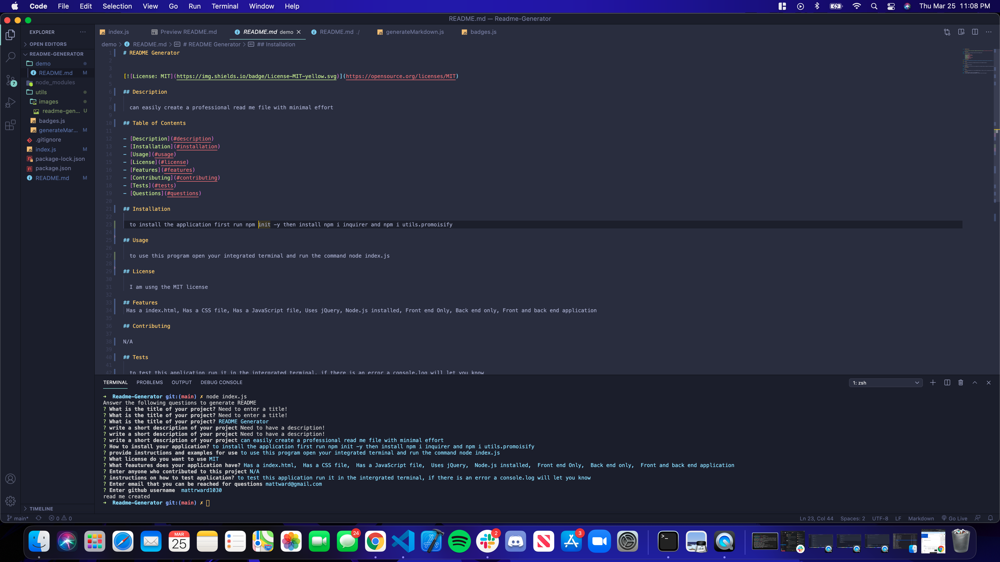

# Readme-Generator

## Approach 

To tackle this task of building a readme.md generator I had to first define a array of objects that would contain my questions. These questions would later be run using the npm dependency inqurier. That node module will run prompts to the user in the terminal that they can answer. The application then uses these answers to write a file named README.md in the demo folder. I also added the npm dependency util.promisify. What that does is converts a callback function to a promise based one. That turned out to be very helpful for me in this application. At the end of this project there was three .js files, badges.js, generateMarkdown.js and index.js. The main fucntions were written in index.js, the badges and their links were defined in the badges.js file so that file could be exported and used in the generateMarkdown.js file. The generateMarkdown.js file is the file that captured the answers and using template literals I could append that info to the read me file when it was created. That file was also exported so it could be used in the index.js file. All of this came together to make this application run and generate a great, professional README.md file.

## Installation

To install this repo on your local drive you would have to clone the ssh key from my repo. Head into your local drive of choice in terminal or bash and do a git clone. Once you have done a git clone you are free to start working on this project. If you want to push your changes to my repo then you would have to head into terminal/bash and do a git add . Then a git commit -m explaning the changes made, and finally a git push to push the files onto the repo. 

## Usage 

If you want to use this program, first do a git clone as previously described. Once you have the folder in your vs code then open the integrated terminal by right clicking on the index.js and running the command, node index.js . This will start the program running, follow the prompts and you will have your professional readme.md . The following section has a demonstartion video.

## Finished project
 If you would like a demo of this program, visit https://youtu.be/MoE68tuuecs

## Features
<ul>
<li>A user can use this program to easily and quickly write a README.md file with minimal effort.</li>
<li>Uses a command line to accept the user input.</li>
<li>When the the data is entered in the command line a professional README.md is generated with the title of my project and sections entitled Description, Table of Contents, Installation, Usage, License, Contributing, Tests, and Questions .</li>
<li>When the project title is entered then that is displayed as the title of the README.</li>
<li>When a user enters a description, installation instructions, usage information, contribution guidelines, and test instructions, then these are created as sections in the README file.</li>
<li>If no title or description is entered by the user they are then met with a prompt telling them to enter information, if no information is entered the program will not run.</li>
<li>Whatever license the user chooses during the prompt is then used to make a badge that will appear at the top of the README.md file.</li>
<li>When the user enters their github username and email this is then entered into the questions section of the README, with instructions on how they can be reached.</li>
<li>When I click on the table of contents I am then taken to the corresponding section of the README.</li>
</ul>

## Tests
N/A

## Credits
N/A

## Contributing

Pull requests are welcome and encouraged. Hit me up on my github <a href="https://github.com/mattrward1030">mattrward1030</a>

## Badges
 

## License

MIT License

Copyright (c) [2021] [Matthew Ward]

Permission is hereby granted, free of charge, to any person obtaining a copy
of this software and associated documentation files (the "Software"), to deal
in the Software without restriction, including without limitation the rights
to use, copy, modify, merge, publish, distribute, sublicense, and/or sell
copies of the Software, and to permit persons to whom the Software is
furnished to do so, subject to the following conditions:

The above copyright notice and this permission notice shall be included in all
copies or substantial portions of the Software.

THE SOFTWARE IS PROVIDED "AS IS", WITHOUT WARRANTY OF ANY KIND, EXPRESS OR
IMPLIED, INCLUDING BUT NOT LIMITED TO THE WARRANTIES OF MERCHANTABILITY,
FITNESS FOR A PARTICULAR PURPOSE AND NONINFRINGEMENT. IN NO EVENT SHALL THE
AUTHORS OR COPYRIGHT HOLDERS BE LIABLE FOR ANY CLAIM, DAMAGES OR OTHER
LIABILITY, WHETHER IN AN ACTION OF CONTRACT, TORT OR OTHERWISE, ARISING FROM,
OUT OF OR IN CONNECTION WITH THE SOFTWARE OR THE USE OR OTHER DEALINGS IN THE
SOFTWARE.
